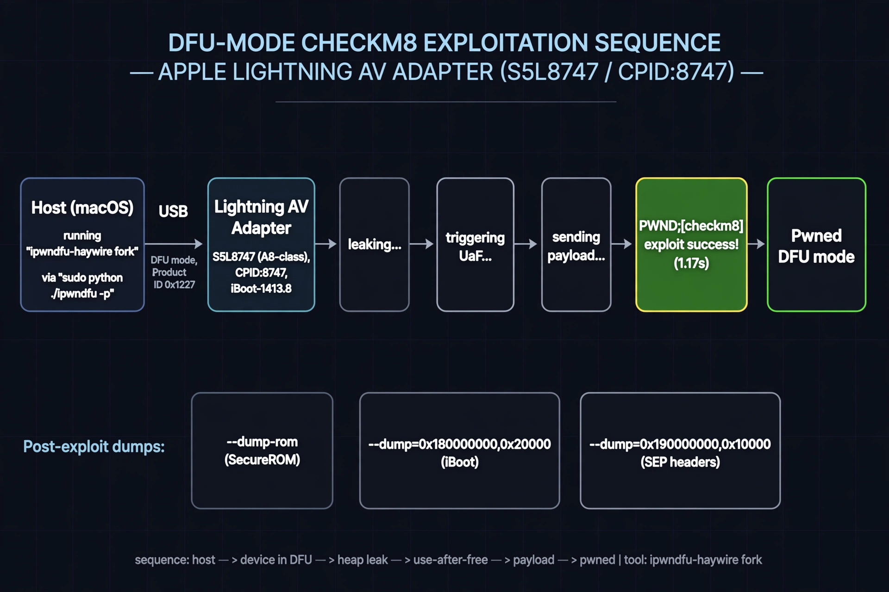

# HAYWIRE — checkm8 SecureROM Research

BootROM/DFU-mode security research against Apple hardware with exploitable
BootROMs. Headline result: **checkm8 achieved against a real Apple accessory
BootROM** (Lightning AV Adapter, S5L8747), plus the DFU toolchain work
(ipwndfu, palera1n, irecovery) needed to operate across A11/A13 iPhones.

> Read-only research posture throughout. Failures are documented next to
> successes. See [REVIEW.md](REVIEW.md) for what is verified, what was
> corrected, and what remains unproven.

## Targets

| Target | Chip | CPID | Notes |
|---|---|---|---|
| Apple Lightning AV Adapter | S5L8747 (A8) | 8747 | checkm8 PWND achieved 2025-05-30, iBoot-1413.8 |
| iPhone X | A11 (T8015) | 8015 | palera1n v2.1-beta.2, iOS 15.5, DFU workflows |
| iPhone 11 (n104) | A13 | — | RESEARCH bootloader upload sequences via irecovery |
| iPhone 8 DVT | A11 | — | CPFM:01 dev unit, IPSW component extraction (iOS 11.0) |

## Timeline

- **2025-04-18 → 2025-06** — Toolchain: resurrecting axi0mX's Python 2.7
  `ipwndfu` on macOS 11.7.10 (T2 MacBook Air) and macOS 15.4 (x86_64)
- **2025-05-30** — `PWND:[checkm8]` on the Lightning AV Adapter
  (`CPID:8747 … exploit success! took 1.17s`); SecureROM dumped
- **2025-06-22 → 2025-08** — DFU/recovery workflows, SecureROM dump attempts,
  A13 SecureROM hex-analysis threads
- **2025-12-19** — iPhone 11 (n104) RESEARCH bootloader upload ordering

## Headline results

1. **Working checkm8 exploit of the S5L8747 accessory BootROM**, with a
   full SecureROM dump (`SecureROM-s5l8747xsi-1413.8-RELEASE.dump`) — see
   [docs/checkm8-av-adapter.md](docs/checkm8-av-adapter.md).

   
2. **Python 2.7 DFU toolchain resurrected on unsupported macOS** — manual
   2.7.18 install, `pyusb`/`libusb` wiring, Python 2→3 `sed` migration of
   ipwndfu, Git LFS `bin/` fix — see [docs/toolchain.md](docs/toolchain.md).
3. **Operational irecovery bootchain upload order** for n104 RESEARCH
   bootloaders: iBSS → iBEC → LLB → iBoot → DeviceTree → sep-firmware →
   kernel → ramdisk → `bootx`.
4. **Unverified:** an assistant-generated claim of a new A13 SecureROM
   vulnerability (bounds-check bypass at `0x124a8`). Treated as unproven —
   see [docs/secure-rom-notes.md](docs/secure-rom-notes.md) and
   [REVIEW.md](REVIEW.md).

## File guide

```
haywire/
├── README.md                      # this file
├── REVIEW.md                      # technical review: corrections, flags, open questions
└── docs/
    ├── checkm8-av-adapter.md      # S5L8747 exploit procedure, receipts, dump sequence
    ├── toolchain.md               # ipwndfu on modern macOS, pyusb, LFS, DCSD serial
    ├── secure-rom-notes.md        # SecureROM/iBoot/SEP dump notes, A13 analysis status
    ├── glossary.md                # DFU, SecureROM, checkm8, CPID-field terminology
    └── images/                    # diagrams (see below)
```

## Diagrams

All under `docs/images/` and embedded in the relevant docs:

| Diagram | Shows | In |
|---|---|---|
| `checkm8-flow.webp` | DFU → leak → UaF → payload → PWND sequence + post-exploit dumps | checkm8-av-adapter.md, README |
| `av-adapter-overview.webp` | Illustrated Lightning AV Adapter with S5L8747 callout | checkm8-av-adapter.md |
| `secure-bootchain.webp` | Apple secure boot chain; where checkm8 strikes | checkm8-av-adapter.md |
| `toolchain-device-map.webp` | ipwndfu / palera1n / irecovery → their target devices | toolchain.md |
| `dfu-device-states.webp` | DFU → pwned DFU → recovery → normal boot states | toolchain.md |
| `irecovery-bootchain-sequence.webp` | n104 RESEARCH upload order, step by step | toolchain.md |

Diagrams were AI-generated and manually checked for legibility and spelling.
The adapter illustration's board-level details are illustrative; all labels
naming the chip, CPID, and iBoot version are sourced. See REVIEW.md.

## Source

Reconstructed from 30 project conversations (2025-04-18 → 2025-12-31).
One additional conversation tagged to this project (a job search,
2026-06-30) contains no project content and was excluded.
