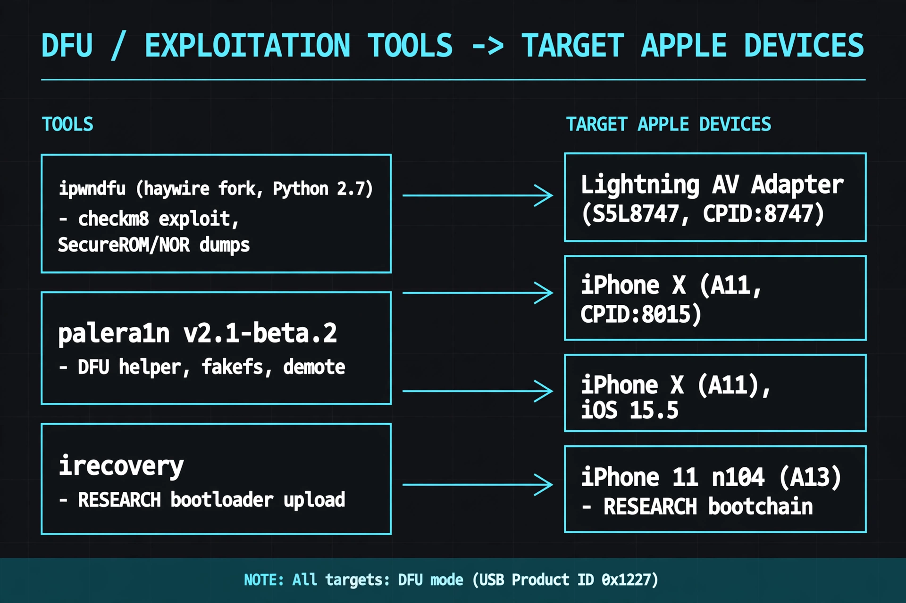
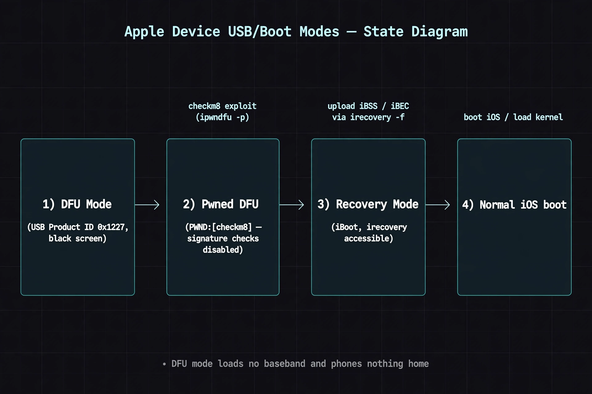
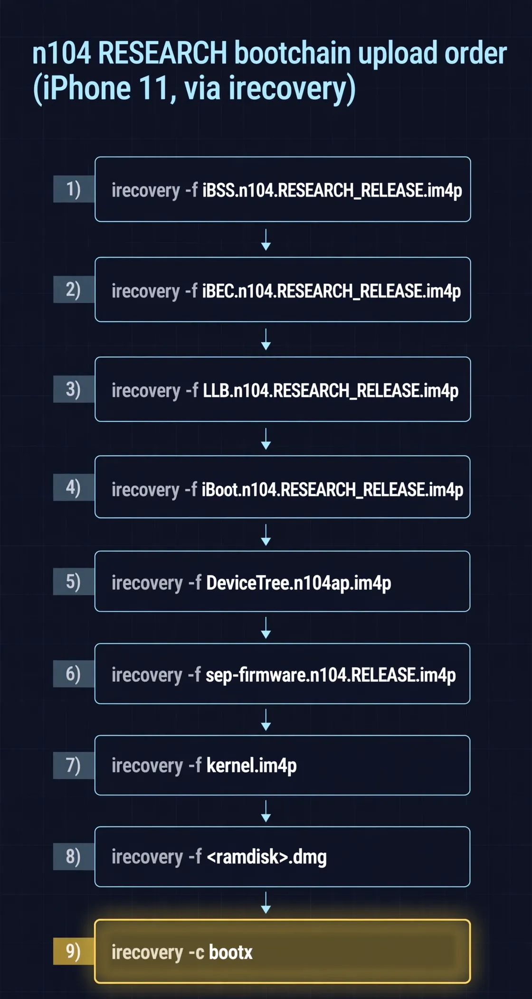

# Toolchain: ipwndfu on Modern macOS

`ipwndfu` (axi0mX) is Python 2.7-only. Modern macOS ships no Python 2, and
`brew install python@2` no longer exists. This is the working setup,
validated on macOS 11.7.10 (T2 MacBook Air) and macOS 15.4 (x86_64).



## 1. Python 2.7 (macOS 11.7.10 path — validated)

```bash
curl -O https://www.python.org/ftp/python/2.7.18/python-2.7.18-macosx10.9.pkg
sudo installer -pkg python-2.7.18-macosx10.9.pkg -target /
/usr/local/bin/python2.7 --version        # Python 2.7.18

echo 'export PATH="/usr/local/bin:$PATH"' >> ~/.zshrc && source ~/.zshrc

curl https://bootstrap.pypa.io/pip/2.7/get-pip.py -o get-pip2.py
sudo python2.7 get-pip2.py                 # provides pip2

pip2 install pyusb
brew install libusb
```

Run ipwndfu with the interpreter explicitly:

```bash
sudo python2.7 ./ipwndfu -p
```

Do **not** rely on `brew install python@2` — the formula is gone. Any guide
still recommending it is stale (this mistake appears in the transcripts and
was corrected).

## 2. Python 3 path (macOS 15.4 — validated)

PEP 668 blocks system-wide `pip install` (`externally-managed-environment`).
Use a virtualenv:

```bash
brew install libusb python3
python3 -m venv venv
source venv/bin/activate
pip install pyusb
```

Then migrate the ipwndfu script from Python 2 to 3 with `sed` (macOS
`sed -i ''` syntax):

```bash
cd ipwndfu
cp ipwndfu ipwndfu.bak

# print statements -> print()
sed -i '' -E 's/print[[:space:]]+(.*)/print(\1)/g' ipwndfu
# except X, e -> except X as e
sed -i '' 's/except Exception, e/except Exception as e/g' ipwndfu
# xrange -> range
sed -i '' 's/xrange/range/g' ipwndfu
# integer division
sed -i '' -E 's/([[:alnum:]_]+) \/ ([[:digit:]]+)/\1 \/\/ \2/g' ipwndfu
# shebang
sed -i '' '1s|.*|#!/usr/bin/env python3|' ipwndfu
```

Verify the migration didn't break string/bytes handling before running
against hardware — `sed` migration is syntactic only; `pyusb` calls passing
`str` where `bytes` are expected are the usual runtime failure. Test with
`./ipwndfu` (no args) and read the usage output first.

## 3. `checkm8.py` fixes (validated)

Two real bugs were hit and fixed in the transcripts:

**a) `bin/` path is CWD-relative.** `checkm8.py` opens `bin/%s.bin`
relative to the *current working directory*, so running from anywhere but
the repo root fails with missing-file errors. Fix by anchoring to the
script location:

```python
import os
bin_path = os.path.join(os.path.dirname(os.path.abspath(__file__)), 'bin')
# then: open(os.path.join(bin_path, '%s.bin' % name), 'rb')
```

**b) `checkm8.exploit()` takes no arguments.** Calls of the form
`checkm8.exploit(script_dir)` raise `TypeError`. Call it bare:

```bash
sed -i '' "s/checkm8.exploit(script_dir)/checkm8.exploit()/g" ipwndfu.py
```

## 4. Missing `bin/*.bin` files — Git LFS

The `bin/` payloads (e.g. `usb_0xA1_2_arm64.bin`) are stored in **Git LFS**.
A clone without LFS leaves 130-byte pointer files and the exploit fails.
Fix:

```bash
git lfs install
git lfs pull
```

Or fetch a single missing payload directly:

```bash
cd bin
curl -L -O https://github.com/axi0mX/ipwndfu/raw/master/bin/usb_0xA1_2_arm64.bin
```

Verify with `file bin/*.bin` — real payloads are binaries, not text
pointers. (Upstream mirrors `dora2-iOS/ipwndfu_public` and
`Arna13/iBoot64Dumper` were dead at the time of the research; prefer the
canonical axi0mX repo.)

## 5. USB device access on macOS

DFU-mode Apple devices enumerate at Product ID `0x1227`. The
`system_profiler`-and-`awk` pipelines in the transcripts for deriving
`/dev` nodes were fragile and mostly broken — including one attempt
against `/dev/bus/usb/...`, which **does not exist on macOS** (Linux-only).
Practical approach: identify the device with

```bash
system_profiler SPUSBDataType | grep -B5 -A5 "0x1227"
```

and, if permission errors occur, run ipwndfu under `sudo` rather than
`chmod`-ing device nodes.



## 6. DCSD cable serial ports

The HWTE Alex DCSD cable presents multiple serial ports. For `screen`
console monitoring, use the primary `cu` device:

```bash
screen /dev/cu.usbserial-DCSD_PRI_v1 115200
```

(`cu.*` for initiating connections; `tty.*` is the inbound side. Observed
ports also included `cu.usbserial-4/5/6`, `cu.usbserial-A107XBVO`,
`cu.usbserial-ALX_REAL`.)

## 7. palera1n (iPhone X, iOS 15.5) — validated flags

palera1n v2.1-beta.2 on macOS x86_64:

```bash
sudo ./palera1n-macos-x86_64 -D        # DFU helper, exit after entering DFU
sudo ./palera1n-macos-x86_64 -E        # enter recovery mode
sudo ./palera1n-macos-x86_64 -C -c     # clean then set up fakefs
sudo ./palera1n-macos-x86_64 -d        # demote
```

Note: `-C -c` without `-f` (rootful) or `-l` (rootless) aborts with
"Please specify rootful (-f) or rootless (-l)". Full help: `-h`.

## 8. irecovery RESEARCH bootchain (iPhone 11, n104) — validated order

```bash
irecovery -f Firmware/dfu/iBSS.n104.RESEARCH_RELEASE.im4p
irecovery -f Firmware/dfu/iBEC.n104.RESEARCH_RELEASE.im4p
irecovery -f Firmware/all_flash/LLB.n104.RESEARCH_RELEASE.im4p
irecovery -f Firmware/all_flash/iBoot.n104.RESEARCH_RELEASE.im4p
irecovery -f Firmware/all_flash/DeviceTree.n104ap.im4p
irecovery -f Firmware/all_flash/sep-firmware.n104.RELEASE.im4p
irecovery -f kernel.im4p
irecovery -f 038-96331-065.dmg          # ramdisk
irecovery -c "bootx"
```

Order is iBSS → iBEC → LLB → iBoot → DeviceTree → sep-firmware → kernel →
ramdisk → `bootx`. Filenames are build-specific (example: 18D70).


*Filenames are build-specific (example build 18D70).*
